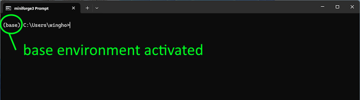
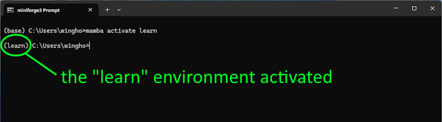

# Installing python locally

## Installing the miniforge python distribution

In this course we have been relying on the JupyterHub server provided by the University of Washington to run our Jupyter notebooks. However, your JupyterHub account is tied to the course and will end some time after the course ended.

An alternative to using JupyterHub is to install python on your local machine. There are a few routes to do so, but we recommend the miniforge distribution. You can find and download the installer on [https://conda-forge.org/download/](https://conda-forge.org/download/)

Once the installer is downloaded, follow the installation instruction and install the miniforge distribution. Once miniforge is installed, start a terminal (command prompt in Windows, Terminal in MacOS, etc.) with the base mamba environment activated (in Windows there is a separate icon for that, in Mac your Terminal should be configured to activate the base environment automatically). A mamba enabled terminal with the base environment activated should have a prompt that started with the text `(base)`.



**Figure**: A mamba enabled terminal.

## Installing third-party modules

The base environment has a very limited number of third-party modules installed. So our next step is to install the third-party packages that you are now familiar with (numpy, scipy, pandas, xarray, matplotlib, etc.). While we can install these packages in the base environment, we recommend doing so in a new environment. In this appendix we'll call this new environment "learn", but you should feel free to change that name in the subsequent code.

The easiest way to create a new environment with the desired packages installed is to use a requirements.txt file. You can find an example of the requirements.txt file [here](https://github.com/OCEAN-215-2025/preclass/blob/main/appendix/data/requirements.txt).

Download the requirements.txt file to your local computer, then, change directory (via `cd`, using the same text-based file navigation convention we discussed in week 6) to the location of the requirements file, and execute the following command:

```
    mamba create -n learn --file requirement.txt
```

(change the name `learn` to whatever way you want to name your environment)

Once the above command is entered, mamba should get to work and figure out what packages you need to install (some of the modules included in requirement.txt have prerequisites that are not listed, and mamba will take care of install those too). Confirm that the installation plan is correct, and mamba will create the environment and install the packages in it.

Once mamba is finished, follow the instruction it provides to activate the `learn` environment, namely:

```
    mamba activate learn
```

When the `learn` environment is activated, the prompt of the terminal should start with the text `(learn)`.



**Figure**: A terminal with the "learn" environment activated.


## Starting JupyterLab

Instead of JupyterHub, in a local installation you would like to view your Jupyter notebooks using JupyterLab. To view your notebook in JupyterLab, first change directory (again via `cd`) to the folder containing your notebook. Then, in the terminal, run:

```
    jupyter lab
```

Your browser should automatically open with a JupyterLab page (which has similar interface as the JupyterHub page) that shows your notebook. You can now work on the notebook like you did with JupyterHub.
